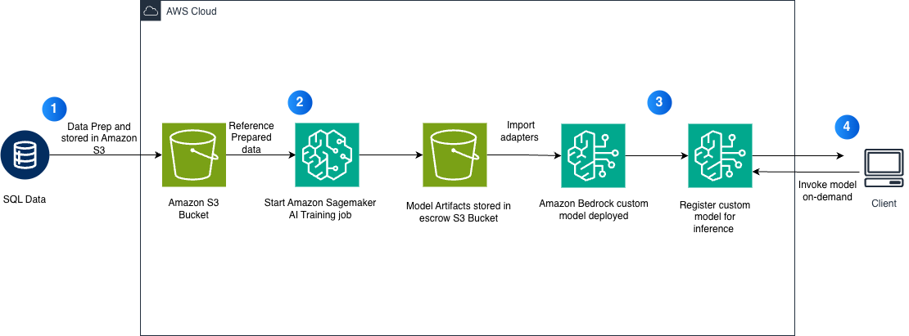

# Amazon Nova Micro Fine-Tuning for Text-to-SQL Generation

This notebook demonstrates how to fine-tune Amazon Nova Micro using Supervised Fine-Tuning (SFT) with Parameter-Efficient Fine-Tuning (PEFT LoRA) for text-to-SQL generation tasks.

## Overview

Fine-tune Amazon Nova Micro to convert natural language questions into SQL queries using:
- **SageMaker Training Job** with Nova-specific recipes
- **LoRA (Low-Rank Adaptation)** for efficient fine-tuning using adapter layers
- **Bedrock deployment** for on-demand inference

## Architecture

## Prerequisites

- AWS Account with access to:
  - Amazon SageMaker
  - Amazon Bedrock
  - Amazon S3
- IAM role with appropriate permissions
- Python 3.10+
- AWS Region -us-east-1

## Dataset

Uses the [sql-create-context](https://huggingface.co/datasets/b-mc2/sql-create-context) dataset:
- 78,577 SQL examples
- Converted to `bedrock-conversation-2024` format

## Workflow

### 1. Data Preparation
- Load SQL dataset from Hugging Face
- Convert to Bedrock conversation format
- Split into train/test sets
- Upload to S3

### 2. Model Training
- **Instance**: `ml.g5.48xlarge`
- **Recipe**: `nova_micro_g5_g6_48x_gpu_lora_sft`
- **Training time**: ~4 hours
- **Method**: LoRA PEFT

### 3. Model Deployment
- Import model to Bedrock
- Create on-demand deployment
- No infrastructure management required

### 4. Evaluation
- Test on 100 samples
- LLM-as-a-judge scoring (Claude 3.5 Haiku)
- Performance metrics: TTFT, OTPS
- Cost analysis comparison

## Usage

1. Open the notebook in SageMaker Studio or Jupyter
2. Run cells sequentially
3. Wait for training job completion (~4 hours)
4. Deploy model to Bedrock
5. Run evaluation and metrics
6. Run cleanup cell to delete resources

## Cleanup

Run the final cleanup cell to delete:
- Bedrock deployment
- Custom model
- IAM role and policy
- Local data directory

## Resources Created

- SageMaker Training Job
- Bedrock Custom Model
- Bedrock Deployment
- IAM Role: `BedrockNovaImportRole`
- IAM Policy: `BedrockNovaS3Access`
- S3 Objects: Training data in `s3://{bucket}/datasets/nova-sql-context/`

