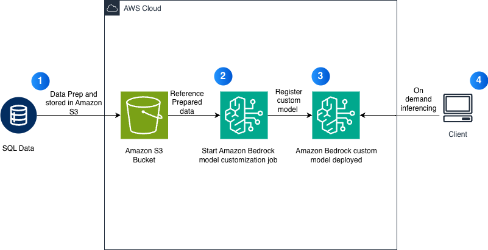

# Amazon Nova Micro Fine-Tuning for Text-to-SQL with Bedrock Custom Models

This notebook demonstrates how to fine-tune Amazon Nova Micro using Amazon Bedrock Custom Models for text-to-SQL generation tasks.

## Overview

Fine-tune Amazon Nova Micro to convert natural language questions into SQL queries using:
- **Bedrock Custom Model Jobs** for managed fine-tuning
- **Bedrock deployment** for on-demand inference

## Architecture

## Prerequisites

- AWS Account with access to:
  - Amazon Bedrock (with Nova model access)
  - Amazon S3
- IAM role with appropriate permissions
- Python 3.10+
- AWS Region -us-east-1

## Dataset

Uses the [sql-create-context](https://huggingface.co/datasets/b-mc2/sql-create-context) dataset:
- 78,577 SQL examples
- Converted to `bedrock-conversation-2024` format
- **20,000 total samples maximum** (Bedrock limit)

## Workflow

### 1. Data Preparation
- Load SQL dataset from Hugging Face
- Convert to Bedrock conversation format
- Enforce 20k total sample limit
- Split into train/validation sets
- Upload to S3

### 2. IAM Role Setup
- Create `BedrockNovaCustomModelRole`
- Attach S3 access policy
- Configure trust relationship for Bedrock

### 3. Model Fine-Tuning
- **Base Model**: `amazon.nova-micro-v1:0`
- **Training time**: 30+ minutes
- **Hyperparameters**:
  - Epochs: 1
  - Batch Size: 1
  - Learning Rate: 0.00001

### 4. Model Deployment
- Option 1: On-demand inference (pay per token)
- No infrastructure management required

### 5. Evaluation
- LLM-as-a-judge scoring 
- Performance metrics: TTFT, throughput

## Usage

1. Open the notebook in SageMaker Studio or Jupyter
2. Run cells sequentially
3. Wait for fine-tuning job completion (~30+ minutes)
4. Deploy model for inference
5. Run evaluation and metrics
6. Run cleanup cell to delete resources

## Cleanup

Run the final cleanup cell to delete:
- Provisioned throughput (if created)
- Custom model
- IAM role and policy
- Local data directory

## Resources Created

- Bedrock Custom Model Fine-tuning Job
- Bedrock Custom Model
- Bedrock Provisioned Throughput (optional)
- IAM Role: `BedrockNovaCustomModelRole`
- IAM Policy: `BedrockNovaS3Access`
- S3 Objects: Training data in `s3://{bucket}/bedrock-nova-finetuning/{timestamp}/`

## Troubleshooting

### Dataset Size Error
- Ensure total samples ≤ 20,000
- Check train + validation combined count
- Reduce dataset size if needed
