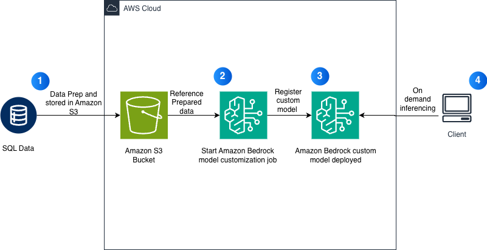

# Amazon Bedrock Custom Models を使った Amazon Nova Micro の Text-to-SQL 向けファインチューニング

このノートブックでは、Text-to-SQL 生成タスク向けに Amazon Bedrock Custom Models を使って Amazon Nova Micro をファインチューニングする方法を示します。

## 概要

Amazon Nova Micro をファインチューニングし、自然言語の質問を SQL クエリへ変換します。利用する要素は次のとおりです。
- マネージドなファインチューニング向けの **Bedrock Custom Model Jobs**
- オンデマンド推論向けの **Bedrock deployment**

## アーキテクチャ

## 前提条件

- 次へアクセス可能な AWS アカウント:
  - Amazon Bedrock（Nova モデルへのアクセスを含む）
  - Amazon S3
- 適切な権限を持つ IAM ロール
- Python 3.10+
- AWS リージョン: us-east-1

## データセット

[sql-create-context](https://huggingface.co/datasets/b-mc2/sql-create-context) データセットを使用します。
- 78,577 件の SQL 例
- `bedrock-conversation-2024` 形式へ変換
- **合計サンプル数は最大 20,000 件**（Bedrock の制限）

## ワークフロー

### 1. データ準備
- Hugging Face から SQL データセットを読み込む
- Bedrock conversation 形式へ変換する
- 合計 20k サンプル制限を適用する
- train / validation セットへ分割する
- S3 へアップロードする

### 2. IAM ロール設定
- `BedrockNovaCustomModelRole` を作成
- S3 アクセスポリシーをアタッチ
- Bedrock 向けの trust relationship を設定

### 3. モデルのファインチューニング
- **Base Model**: `amazon.nova-micro-v1:0`
- **Training time**: 30 分以上
- **Hyperparameters**:
  - Epochs: 1
  - Batch Size: 1
  - Learning Rate: 0.00001

### 4. モデルのデプロイ
- オプション 1: オンデマンド推論（トークン課金）
- インフラ管理は不要

### 5. 評価
- LLM-as-a-judge スコアリング
- 性能指標: TTFT、throughput

## 使い方

1. SageMaker Studio または Jupyter でノートブックを開く
2. セルを順番に実行する
3. ファインチューニングジョブの完了を待つ（約 30 分以上）
4. 推論用にモデルをデプロイする
5. 評価とメトリクス計測を実行する
6. クリーンアップセルを実行してリソースを削除する

## クリーンアップ

最後のクリーンアップセルを実行して、次を削除します。
- Provisioned Throughput（作成した場合）
- Custom model
- IAM ロールとポリシー
- ローカルデータディレクトリ

## 作成されるリソース

- Bedrock Custom Model Fine-tuning Job
- Bedrock Custom Model
- Bedrock Provisioned Throughput（任意）
- IAM Role: `BedrockNovaCustomModelRole`
- IAM Policy: `BedrockNovaS3Access`
- S3 Objects: `s3://{bucket}/bedrock-nova-finetuning/{timestamp}/` 内の学習データ

## トラブルシューティング

### Dataset Size Error
- 合計サンプル数が 20,000 以下であることを確認する
- train + validation の合計件数を確認する
- 必要に応じてデータセットサイズを削減する