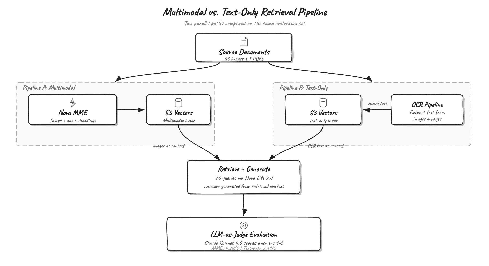
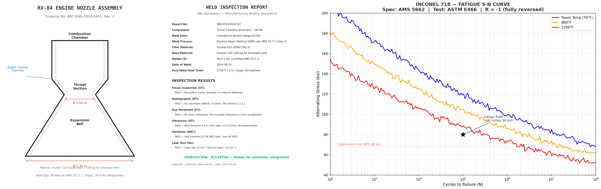

# Manufacturing Intelligence with Amazon Nova Multimodal Embeddings

This sample builds a multimodal retrieval system for aerospace manufacturing documents using [Amazon Nova Multimodal Embeddings](https://docs.aws.amazon.com/nova/latest/nova2-userguide/embeddings.html) on Amazon Bedrock and [Amazon S3 Vectors](https://aws.amazon.com/s3/vectors/). It compares a multimodal pipeline (embed images directly) against a text-only baseline (OCR then embed text) on 26 manufacturing queries, measuring both retrieval quality and downstream generation quality with an LLM-as-Judge evaluation.



## Dataset

The dataset contains synthetic aerospace manufacturing documents: 15 standalone technical images (CAD diagrams, inspection reports, test plots, material specifications, process flow charts) and 5 multi-page PDFs (assembly procedures, hot-fire test reports, engineering change notices, material certifications, non-conformance reports).



## Prerequisites

- An AWS account with access to Amazon Bedrock in `us-east-1`
- Model access enabled for `amazon.nova-2-multimodal-embeddings-v1:0` and `us.amazon.nova-2-lite-v1:0`
- An Amazon SageMaker AI notebook instance or local Python environment
- Python 3.10+
- IAM permissions for Amazon Bedrock `InvokeModel`, Amazon S3, and Amazon S3 Vectors APIs

## Setup

```bash
pip install -r requirements.txt
```

## Notebook

| Notebook | Description |
|----------|-------------|
| [01_manufacturing_multimodal_retrieval.ipynb](01_manufacturing_multimodal_retrieval.ipynb) | End-to-end pipeline: embed documents, build S3 Vectors indexes, run retrieval and generation evaluation |

The notebook walks through:

1. **Multimodal embedding** of images and PDF pages with Amazon Nova Multimodal Embeddings
2. **Text-only baseline** using Amazon Nova Lite 2.0 for OCR, then embedding the extracted text
3. **Vector indexing** with Amazon S3 Vectors (cosine similarity, 1024 dimensions)
4. **Retrieval evaluation** with Recall@K, MRR, and NDCG@K
5. **Generation evaluation** using Amazon Nova Lite 2.0 for answer generation and Anthropic Claude Sonnet 4.5 as an LLM judge

## Cleanup

Delete the S3 Vectors indexes and bucket after completing the evaluation to avoid ongoing costs. The notebook includes cleanup commands (commented out for safety).

## Security

See [CONTRIBUTING](https://github.com/aws-samples/amazon-nova-samples/blob/main/CONTRIBUTING.md) for more information.

## License

This library is licensed under the MIT-0 License. See the [LICENSE](https://github.com/aws-samples/amazon-nova-samples/blob/main/LICENSE) file.
