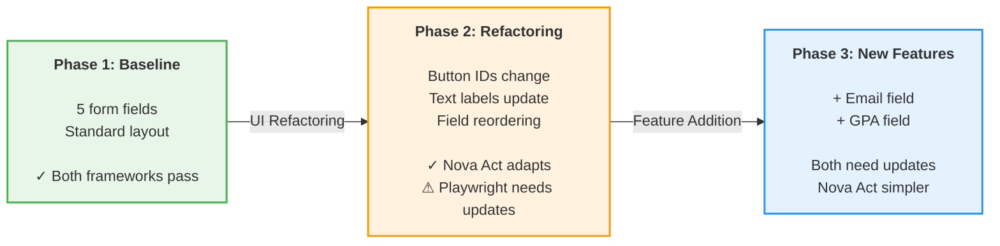
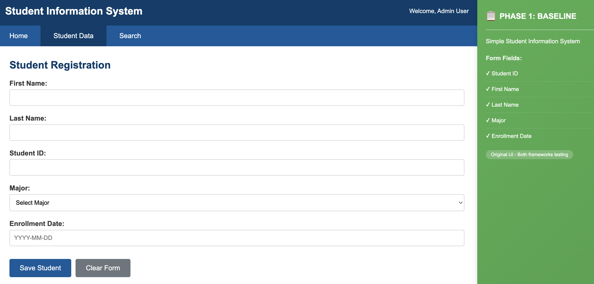
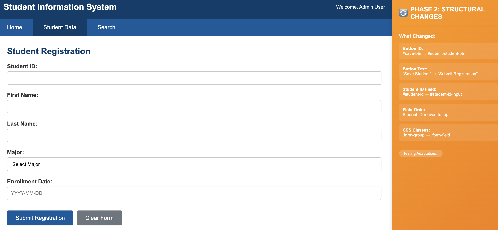
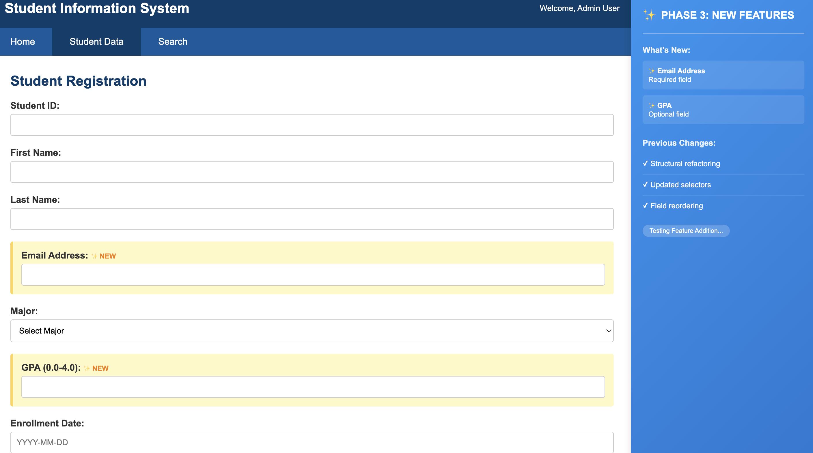

# Adaptive UI Testing with Amazon Nova Act

**Demonstrating AI-powered browser automation that adapts to UI changes through natural language and visual understanding**

## Overview

As generative AI capabilities advance, we can now approach browser automation differently: testing applications the way humans interact with them, through natural language instructions and visual context rather than hardcoded DOM selectors.

This sample demonstrates **Amazon Nova Act**, an AI-powered browser automation tool that understands UI elements through natural language and visual relationships. When UI structures evolve, whether through refactoring, design updates, or new features, Nova Act adapts automatically by interpreting elements contextually, similar to how a human tester would.

**What you'll learn:**
- How AI-powered automation complements traditional selector-based testing
- Natural language test definitions that remain stable across UI changes
- Visual context awareness for element identification
- Practical comparison of adaptation capabilities across three realistic scenarios

## The Evolution of Browser Automation

Traditional browser automation relies on precise DOM selectors (`#submit-btn`, `.form-input`). This approach is fast and deterministic, but requires updates when UI structures change, a common occurrence in modern agile development.

With advances in multimodal AI, we can now leverage:
- **Natural language understanding** - "Click the submit button" instead of `page.click('#submit-btn')`
- **Visual context awareness** - Identifying elements by their labels, position, and visual relationships
- **Adaptive interpretation** - Understanding intent even when implementation details change

This opens new possibilities for test resilience and maintainability, especially in environments with frequent UI evolution.

## The Demo Journey

This sample walks through three phases that simulate a realistic development cycle:



**Phase 1** establishes a baseline with both Playwright and Nova Act testing the same UI successfully.

**Phase 2** applies structural refactoring (button IDs, text labels, field order) to demonstrate adaptation. Playwright requires selector updates, while Nova Act continues working through natural language interpretation.

**Phase 3** introduces new features (email and GPA fields) where both frameworks need test updates, showcasing how Nova Act's natural language approach simplifies test maintenance.

## What Makes Nova Act Different

### Traditional Approach (Selector-Based)
```javascript
// Precise but requires updates when structure changes
await page.fill('#student-id', 'S999');
await page.click('#save-btn');
```

When the UI evolves:
- Button ID changes from `#save-btn` to `#submit-student-btn`
- Test needs selector updates
- Maintenance required across test suite

### Nova Act Approach (Natural Language + Visual Context)
```json
{
  "action": "Enter student ID S999"
},
{
  "action": "Click the save button"
}
```

When the UI evolves:
- Nova Act interprets "save button" through visual context
- Adapts to selector changes automatically
- Tests continue working without updates

**The opportunity:** As AI capabilities advance, we can write tests that adapt to UI evolution, complementing traditional approaches with natural language resilience.

## Getting Started with the Demo

To experience Nova Act's adaptation capabilities firsthand, you'll set up a local environment with both testing frameworks and run through the three-phase demonstration. The setup takes about 5 minutes and requires Python, Node.js, and AWS credentials.

## Prerequisites

- **Python 3.11+** - For Nova Act test runner
- **Node.js 22+** - For Playwright comparison tests
- **AWS IAM credentials** - With Nova Act permissions (see setup below)

### Configure AWS IAM Authentication

The Nova Act SDK authenticates using AWS IAM credentials by default. When no API key is provided, the SDK automatically uses your configured AWS credentials. This is the recommended approach for development and production use.

Ensure you have [AWS credentials configured](https://docs.aws.amazon.com/cli/latest/userguide/cli-configure-files.html) in your development environment. Your AWS IAM user or role needs the following permissions. Create a customer-managed policy with this JSON:

```json
{
    "Version": "2012-10-17",
    "Statement": [
        {
            "Effect": "Allow",
            "Action": [
                "nova-act:*"
            ],
            "Resource": [
                "*"
            ]
        },
        {
            "Effect": "Allow",
            "Action": "iam:CreateServiceLinkedRole",
            "Resource": "*",
            "Condition": {
                "StringLike": {
                    "iam:AWSServiceName": "nova-act.amazonaws.com"
                }
            }
        }
    ]
}
```

Attach this policy to your IAM user or role. See [AWS Managed Policies for Nova Act](https://docs.aws.amazon.com/nova-act/latest/userguide/security-iam-awsmanpol.html) for more details.

For more information, see the [Nova Act IAM authentication documentation](https://docs.aws.amazon.com/nova-act/latest/userguide/step-2-develop-locally.html#which-authentication-method).

<details>
<summary><b>Alternative: API Key Authentication</b></summary>

If you prefer to use an API key instead of IAM authentication, you can generate one at [nova.amazon.com/act](https://nova.amazon.com/act).

Create a `.env` file in the `nova-act-tests/` directory:

```bash
nano nova-act-tests/.env
```

Add your API key:
```
NOVA_ACT_API_KEY=your-key-here
```

Nova Act will use the API key from this file when IAM credentials are not available.

</details>

## Getting Started

### 1. Clone and Install

```bash
git clone https://github.com/aws-samples/adaptive-ui-testing-with-nova-act
cd adaptive-ui-testing-with-nova-act
./setup.sh
```

The setup script installs:
- Playwright and Chromium browser
- Python virtual environment with Nova Act SDK
- All dependencies for both frameworks

### 2. Create Workflow Definition

Create a Nova Act workflow definition (required for IAM authentication):

```bash
cd nova-act-tests
source venv/bin/activate
act workflow create --name adaptive-ui-testing
deactivate
cd ..
```

### 3. Start the Sample Application

```bash
cd sample-app && python3 -m http.server 8000
```

Keep this server running throughout the demo. Visit http://localhost:8000 to see the Student Information System.

## Running the Demo

This demo consists of three phases that you run manually, observing how each framework responds to UI changes.

### Phase 1: Baseline Testing


*Original form with Student ID, First Name, Last Name, Major, and Enrollment Date*

Establish a baseline with both frameworks testing the original UI:

```bash
./phase1-baseline.sh
```

**What happens:**
- Tests the original 5-field student registration form
- Both Playwright and Nova Act pass successfully
- Strict validation confirms actual test success (not just exit codes)

**Expected output:**
```
✓ VERIFIED: Playwright test passed
✓ VERIFIED: Nova Act test passed
```

**View test artifacts:**
- Playwright screenshots: `playwright-tests/test-results/`
- Nova Act logs: `nova-act-tests/screenshots/NA-01/`
  - HTML trace files with embedded screenshots (interactive execution replay)
  - JSON call logs
  - To enable video recording, set `record_video=True` in NovaAct initialization (see [Nova Act documentation](https://docs.aws.amazon.com/nova-act/latest/userguide/what-is-nova-act.html))

### Phase 2: Structural Changes


*Button IDs, text labels, and field order changed - orange side panel shows what changed*

Apply UI refactoring to demonstrate adaptation:

```bash
./phase2-structural.sh
```

**What happens:**
- Modifies the UI in place with structural changes:
  - Button ID: `#save-btn` → `#submit-student-btn`
  - Button text: "Save Student" → "Submit Registration"
  - Field IDs and CSS classes updated
  - Field order rearranged
- Displays a visual banner showing all changes
- Runs both test suites against the modified UI

**Refresh your browser** to see the changes and the yellow banner explaining what changed.

**Expected results:**
- Playwright: Requires selector updates (demonstrates traditional approach)
- Nova Act: Runs the exact same Phase 1 test and continues working through natural language interpretation

**View test artifacts:**
- Playwright screenshots: `playwright-tests/test-results/`
- Nova Act logs: `nova-act-tests/screenshots/NA-01/`
  - HTML trace files with embedded screenshots (interactive execution replay)
  - JSON call logs
  - To enable video recording, set `record_video=True` in NovaAct initialization (see [Nova Act documentation](https://docs.aws.amazon.com/nova-act/latest/userguide/what-is-nova-act.html))

### Phase 3: New Features


*Email and GPA fields added - blue side panel shows what's new*

Add new form fields to demonstrate feature adaptation:

```bash
./phase3-features.sh
```

**What happens:**
- Adds two new fields to the form:
  - Email Address (required)
  - GPA (optional)
- Both frameworks need test updates
- Demonstrates how Nova Act's natural language approach simplifies additions

**Refresh your browser** to see the new fields highlighted with "✨ NEW" badges.

**Expected results:**
- Both frameworks need updates for new fields
- Nova Act uses simpler natural language additions
- Comparison shows maintenance differences

**View test artifacts:**
- Playwright screenshots: `playwright-tests/test-results/`
- Nova Act logs: `nova-act-tests/screenshots/NA-03/`
  - HTML trace files with embedded screenshots (interactive execution replay)
  - JSON call logs
  - To enable video recording, set `record_video=True` in NovaAct initialization (see [Nova Act documentation](https://docs.aws.amazon.com/nova-act/latest/userguide/what-is-nova-act.html))

### Reset UI to Phase 1 Baseline

Return the application to its original Phase 1 state:

```bash
./restore-original.sh
```

Restores the original UI while preserving backup files for reference.

**Note:** This demo runs Nova Act in **visible browser mode** (`headless=False`) so you can observe the AI agent's actions in real-time. For production CI/CD pipelines, use `headless=True` for faster, background execution.

## Understanding the Results

### Phase 1: Establishing the Baseline

Both frameworks successfully test the original UI, demonstrating that they can work with stable interfaces:

```
✓ VERIFIED: Playwright test passed
✓ VERIFIED: Nova Act test passed
```

The strict validation parses actual test output to confirm success, not just exit codes.

### Phase 2: Observing Adaptation

When structural changes are applied, you'll see a visual banner in the browser showing exactly what changed:

```
━━━━━━━━━━━━━━━━━━━━━━━━━━━━━━━━━━━━━━━━━━━━━━━━━━━━━
PHASE 2: STRUCTURAL CHANGES APPLIED

What Changed:
✓ Button ID: #save-btn → #submit-student-btn
✓ Button Text: "Save Student" → "Submit Registration"
✓ Student ID: #student-id → #student-id-input
✓ Field Order: Student ID moved to top
✓ CSS Classes: .form-group → .form-field
━━━━━━━━━━━━━━━━━━━━━━━━━━━━━━━━━━━━━━━━━━━━━━━━━━━━━
```

**Playwright** requires selector updates to accommodate the structural changes.

**Nova Act** continues working by interpreting "save button" and "student ID field" through visual context and natural language understanding.

### Phase 3: Adding New Capabilities

New fields appear with visual indicators:

- ✨ **Email Address** (required)
- ✨ **GPA** (optional)

Both frameworks need test updates to cover the new fields. The comparison shows how Nova Act's natural language approach simplifies the additions:

**Playwright:**
```javascript
await page.fill('#email', 'student@example.com');
await page.fill('#gpa', '3.8');
```

**Nova Act:**
```json
{
  "action": "Enter email address student@example.com"
},
{
  "action": "Enter GPA 3.8"
}
```

## How Nova Act Adapts

Nova Act understands and interacts with web pages the same way that a human does:

1. **Natural Language Processing** - Interprets instructions like "Click the save button" without requiring specific selectors
2. **Visual Context Awareness** - Identifies elements by their labels, position, and visual relationships on the page
3. **Adaptive Element Location** - Finds elements even when IDs, classes, or DOM structure changes
4. **Screenshot Analysis** - Uses visual understanding to verify actions and locate elements

This approach complements traditional selector-based testing by providing resilience during UI evolution.

## When to Use Nova Act

Nova Act is ideal for scenarios where UI workflows require high reliability and adaptability:

**Automate end-to-end UI testing** - Accelerate release cycles with automated full user-journey validation directly in the browser. Your agents execute QA test cases intuitively and naturally navigating through UI workflows. This is ideal for teams managing detailed test scenarios and scaling coverage across web properties where maintaining traditional scripts can be resource-intensive and API testing can miss critical interface changes.

**Testing during UI evolution** - When frequent UI changes or refactoring are expected, Nova Act's natural language approach reduces test maintenance overhead. Perfect for agile environments where UI structures evolve rapidly.

**Legacy system modernization** - Testing applications undergoing modernization where UI patterns change frequently. Nova Act adapts to structural changes without requiring constant test updates.

**Complementing traditional testing** - Use Nova Act strategically alongside selector-based frameworks like Playwright. Leverage Playwright for stable, speed-critical tests, and Nova Act for workflows that benefit from adaptation and natural language resilience.

<details>
<summary><b>Reference: Project Structure & Troubleshooting</b></summary>

## Project Structure

```
adaptive-ui-testing-with-nova-act/
├── README.md                          # This file
├── LICENSE                            # MIT-0 License
├── setup.sh                           # One-command setup
├── phase1-baseline.sh                 # Phase 1: Test original UI
├── phase2-structural.sh               # Phase 2: Apply structural changes
├── phase3-features.sh                 # Phase 3: Add new features
├── restore-original.sh                # Restore Phase 1 baseline
├── docs/
│   └── images/                        # Screenshots for documentation
│       ├── phase1-baseline.png
│       ├── phase2-structural.png
│       └── phase3-features.png
├── sample-app/                        # Student Information System
│   ├── index.html                     # UI (modified through phases)
│   ├── app.js                         # JavaScript (modified through phases)
│   └── styles.css                     # Styles with phase panel
├── playwright-tests/
│   ├── playwright.config.js           # Screenshots enabled
│   └── tests/
│       ├── phase1_student.spec.js     # Phase 1 test
│       ├── phase2_structural.spec.js  # Phase 2 test (updated selectors)
│       └── phase3_features.spec.js    # Phase 3 test (+ new fields)
└── nova-act-tests/
    ├── venv/                          # Isolated Python environment
    ├── pytest.ini                     # Clean output configuration
    ├── requirements.txt               # Python dependencies
    ├── tests/
    │   └── test_runner.py             # Enhanced error messages
    └── test_cases/
        ├── phase1_student_registration.json  # Phase 1 test (also used in Phase 2)
        └── phase3_new_features.json          # Phase 3 test (+ email & GPA)
```

## Troubleshooting

### Port 8000 Already in Use
```bash
lsof -i :8000
kill -9 <PID>
```

### Nova Act Authentication Issues
```bash
# Verify AWS credentials are configured (recommended)
aws sts get-caller-identity

# If using API key instead: verify .env file exists and contains your key
cat nova-act-tests/.env
# Should show: NOVA_ACT_API_KEY=your-key-here
```

### Virtual Environment Issues
```bash
cd nova-act-tests
rm -rf venv
python3 -m venv venv
source venv/bin/activate
pip install -r requirements.txt
```

### Playwright Browser Not Found
```bash
cd playwright-tests
npx playwright install chromium
```

### Reset to Original State
```bash
./restore-original.sh
```

</details>

## License

This library is licensed under the MIT-0 License. See the [LICENSE](LICENSE) file.

## Additional Resources

- [Amazon Nova Act Documentation](https://docs.aws.amazon.com/nova/latest/userguide/what-is-nova.html)
- [Amazon Nova Act Samples](https://github.com/aws-samples/amazon-nova-samples/tree/main/nova-act)
- [AWS Blog: Automated Smoke Testing with Nova Act](https://aws.amazon.com/blogs/machine-learning/implement-automated-smoke-testing-using-amazon-nova-act-headless-mode/)
- [Playwright Documentation](https://playwright.dev)
