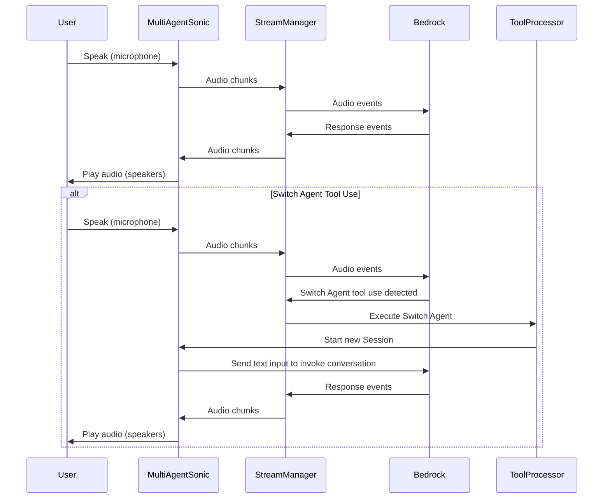
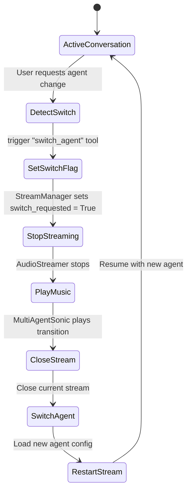

# 🎙️ Nova 2 Sonic Multi-Agent System

A speech-to-speech multi-agent system that unlocks dynamic configuration switching for AWS Bedrock's Nova 2 Sonic model during live conversations.

## ⚠️ The Problem

Speech-To-Speech models face a critical limitation: **static configuration**. Once a conversation starts, you're locked into:
- A single system prompt that can't adapt to different use cases
- One fixed set of tools
- Static voice characteristics

When you need different configurations for different use cases (different prompts and tools), you want specialized agents - each focusing on one task with its own optimized setup. This gives you better control and precision compared to one generalist agent trying to handle everything.

## 💡 The Solution

**Dynamic agent switching using tool triggers** - enabling real-time configuration changes mid-conversation without losing context.

Instead of one overloaded agent, you get:
- Multiple specialized agents, each with focused tools and optimized prompts
- Seamless transitions between agents based on user intent
- Preserved conversation history across switches
- High accuracy maintained through agent specialization

## 🌟 Why This Matters

✅ **Specialization without compromise** - Each agent excels at its domain  
✅ **Seamless user experience** - No jarring resets or context loss  
✅ **Better accuracy** - Fewer tools per agent = better performance  
✅ **New use cases unlocked** - Enterprise support escalation, healthcare triage, financial services routing, and more

## 🚀 Implementation

This demo showcases three specialized agents that switch dynamically based on conversation flow:

- **Support Agent (Matthew)**: Handles customer issues, creates support tickets
- **Sales Agent (Amy)**: Processes orders, provides product information
- **Tracking Agent (Tiffany)**: Checks order status and delivery updates

Each agent brings its own system prompt, tools, and voice - switching happens transparently when the user's intent changes.

## 📁 Project Structure

```
dynamic-configuration/
├── main.py                      # Entry point
├── src/
│   ├── multi_agent.py          # Agent orchestration
│   ├── core/                   # Core functionality
│   │   ├── stream_manager.py  # Bedrock streaming
│   │   ├── event_templates.py # Event generation
│   │   ├── tool_processor.py  # Tool execution
│   │   ├── config.py          # Configuration
│   │   └── utils.py           # Utilities
│   ├── agents/                 # Agent definitions
│   │   ├── agent_config.py    # Agent configs
│   │   └── tools.py           # Tool implementations
│   └── audio/                  # Audio handling
│       └── audio_streamer.py  # Audio I/O
├── docs/                       # Documentation
│   └── STRUCTURE.md           # System design
└── requirements.txt           # Dependencies
```

## ⚙️ Setup

1. **Install dependencies**:
```bash
pip install -r requirements.txt
```

2. **Configure AWS credentials**:
```bash
export AWS_ACCESS_KEY_ID="your_key"
export AWS_SECRET_ACCESS_KEY="your_secret"
export AWS_REGION="us-east-1"
```

3. **Run**:
```bash
python main.py
```

## 🎮 Usage

```bash
# Normal mode
python main.py

# Debug mode
python main.py --debug
```

## 🔧 Configuration

Edit `src/core/config.py` to modify:
- Audio settings (sample rates, chunk size)
- Model parameters (temperature, top_p, max_tokens)
- AWS region and model ID

## 📋 Requirements

- Python 3.12+
- AWS Bedrock access
- Microphone and speakers
- PyAudio dependencies (portaudio)

## Data Flow



## Agent Switching Flow



## Credits
Music by <a href="https://pixabay.com/users/hitslab-47305729/?utm_source=link-attribution&utm_medium=referral&utm_campaign=music&utm_content=324902">Ievgen Poltavskyi</a> from <a href="https://pixabay.com//?utm_source=link-attribution&utm_medium=referral&utm_campaign=music&utm_content=324902">Pixabay</a>


