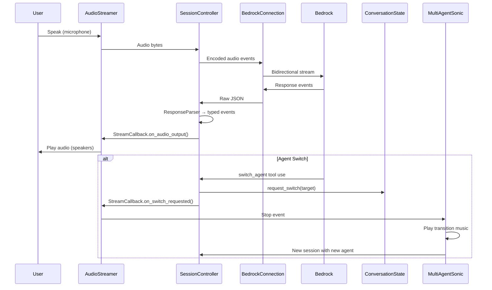
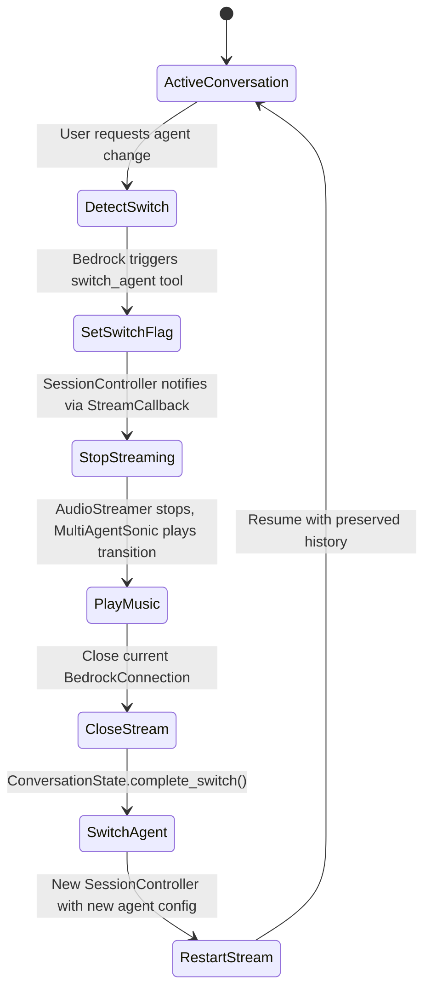

# Nova 2 Sonic Multi-Agent System

A speech-to-speech multi-agent system with dynamic agent switching for AWS Bedrock's Nova 2 Sonic model.

## The Problem

Speech-to-speech models have static configuration — once a conversation starts, you're locked into a single system prompt, one set of tools, and fixed voice characteristics. When different use cases need different configurations, a single generalist agent can't deliver the precision of specialized agents.

## The Solution

Dynamic agent switching using tool triggers — enabling real-time configuration changes mid-conversation without losing context.

- Multiple specialized agents with focused tools and optimized prompts
- Seamless transitions based on user intent
- Preserved conversation history across switches
- Agent specialization for better accuracy

## Agents

| Agent | Voice | Role | Tool |
|-------|-------|------|------|
| Support (Matthew) | matthew | Customer issues, ticket creation | `open_ticket_tool` |
| Sales (Amy) | amy | Orders, product info | `order_computers_tool` |
| Tracking (Tiffany) | tiffany | Order status, delivery updates | `check_order_location_tool` |

All agents share the `switch_agent` tool for seamless handoffs.

## Architecture

```
MultiAgentSonic (orchestrator, while-loop)
      │
      ├→ ConversationState (shared across sessions, owns history + switch state)
      ├→ ToolRegistry (shared across sessions, built once from AGENTS)
      │
      └→ per session:
            ├→ BedrockConnection (raw bidirectional stream)
            ├→ AudioStreamer (PyAudio mic/speaker I/O, implements StreamCallback)
            └→ SessionController (lifecycle coordinator)
                    │
                    ├→ ResponseParser (stateless JSON → typed events)
                    ├→ EventTemplates (protocol JSON generation)
                    ├→ ConversationState (history replay, switch requests)
                    ├→ ToolRegistry (schema lookup, tool execution)
                    └→ StreamCallback → AudioStreamer (audio output, barge-in, switch signal)
```

## Project Structure

```
├── main.py                              # Entry point (--debug flag)
├── assets/
│   └── music.mp3                        # Agent switch transition music
├── src/
│   ├── multi_agent.py                   # MultiAgentSonic orchestrator
│   ├── config.py                        # Audio, AWS, model configuration
│   ├── utils.py                         # Debug logging & timing
│   ├── connection/                      # Bedrock protocol layer
│   │   ├── bedrock_connection.py        # Raw bidirectional stream
│   │   ├── response_parser.py           # Stateless JSON → typed events
│   │   ├── event_templates.py           # Event JSON generators
│   │   └── stream_events.py             # Typed event dataclasses
│   ├── session/                         # Session & state management
│   │   ├── session_controller.py        # Conversation lifecycle coordinator
│   │   ├── conversation_state.py        # State ownership
│   │   └── callbacks.py                 # StreamCallback protocol
│   ├── agents/                          # Agent definitions & tools
│   │   ├── agent_config.py              # Agent + ToolDefinition configs
│   │   ├── tools.py                     # Tool implementations
│   │   └── tool_registry.py             # Unified tool registry
│   └── audio/                           # Audio I/O
│       └── audio_streamer.py            # PyAudio with StreamCallback
└── tests/                               # pytest + hypothesis test suite
```

## Setup

1. Install dependencies:
```bash
pip install -r requirements.txt
```

2. Configure AWS credentials:
```bash
export AWS_ACCESS_KEY_ID="your_key"
export AWS_SECRET_ACCESS_KEY="your_secret"
export AWS_REGION="us-east-1"
```

3. Ensure Nova 2 Sonic model access is enabled in your AWS account (us-east-1).

4. Run:
```bash
# Normal mode
python main.py

# Debug mode (verbose logging)
python main.py --debug
```

## Requirements

- Python 3.12+
- AWS Bedrock access with Nova 2 Sonic enabled
- Microphone and speakers
- portaudio (for PyAudio)

## Data Flow


```mermaid
sequenceDiagram
    participant User
    participant AudioStreamer
    participant SessionController
    participant BedrockConnection
    participant Bedrock

    User->>AudioStreamer: Speak (microphone)
    AudioStreamer->>SessionController: Audio bytes
    SessionController->>BedrockConnection: Encoded audio events
    BedrockConnection->>Bedrock: Bidirectional stream
    Bedrock->>BedrockConnection: Response events
    BedrockConnection->>SessionController: Raw JSON
    SessionController->>SessionController: ResponseParser → typed events
    SessionController->>AudioStreamer: StreamCallback.on_audio_output()
    AudioStreamer->>User: Play audio (speakers)

    alt Agent Switch
        Bedrock->>SessionController: switch_agent tool use
        SessionController->>ConversationState: request_switch(target)
        SessionController->>AudioStreamer: StreamCallback.on_switch_requested()
        AudioStreamer->>MultiAgentSonic: Stop event
        MultiAgentSonic->>MultiAgentSonic: Play transition music
        MultiAgentSonic->>SessionController: New session with new agent
    end
```

## Agent Switching Flow


```mermaid
stateDiagram-v2
    [*] --> ActiveConversation
    ActiveConversation --> DetectSwitch: User requests agent change
    DetectSwitch --> SetSwitchFlag: Bedrock triggers switch_agent tool
    SetSwitchFlag --> StopStreaming: SessionController notifies via StreamCallback
    StopStreaming --> PlayMusic: AudioStreamer stops, MultiAgentSonic plays transition
    PlayMusic --> CloseStream: Close current BedrockConnection
    CloseStream --> SwitchAgent: ConversationState.complete_switch()
    SwitchAgent --> RestartStream: New SessionController with new agent config
    RestartStream --> ActiveConversation: Resume with preserved history
```

## Configuration

Edit `src/config.py`:
- Audio: `INPUT_SAMPLE_RATE`, `OUTPUT_SAMPLE_RATE`, `CHUNK_SIZE`, `CHANNELS`
- AWS: `DEFAULT_MODEL_ID`, `DEFAULT_REGION`
- Model: `MAX_TOKENS`, `TEMPERATURE`, `TOP_P`

## Adding New Agents

1. Implement tool function in `src/agents/tools.py`
2. Add `Agent` with `ToolDefinition` to `AGENTS` dict in `src/agents/agent_config.py`
3. Update the `enum` list in `SWITCH_AGENT_SCHEMA` in `src/agents/tool_registry.py` to include the new agent name

## Credits

Music by [Ievgen Poltavskyi](https://pixabay.com/users/hitslab-47305729/) from [Pixabay](https://pixabay.com/)
