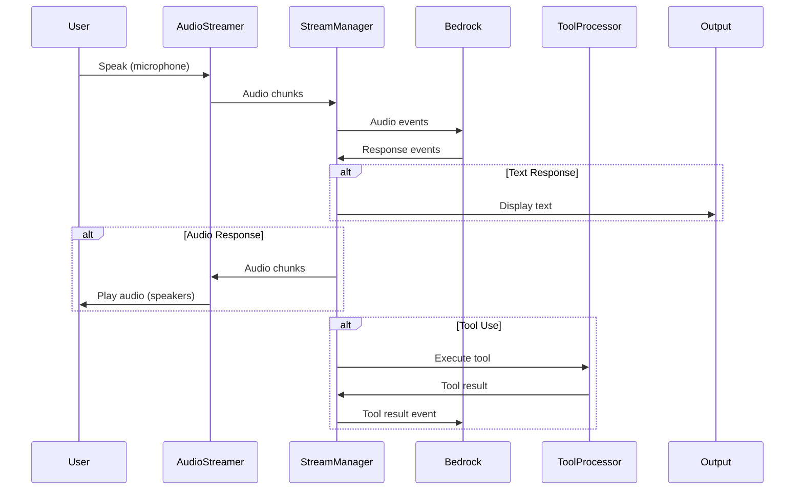
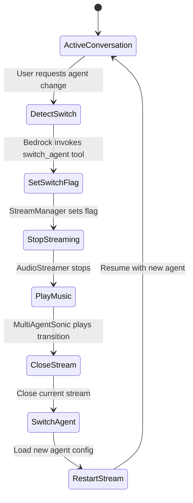

# Project Structure

## Directory Layout

```
sonic_multi_agent/
├── main.py                      # Application entry point
├── README.md                    # Project overview
├── requirements.txt             # Python dependencies
├── music.mp3                    # Transition music for agent switches
├── .gitignore                   # Git ignore patterns
│
├── src/                         # Source code
│   ├── __init__.py
│   ├── multi_agent.py          # Multi-agent orchestrator
│   │
│   ├── core/                   # Core functionality
│   │   ├── __init__.py
│   │   ├── stream_manager.py  # Bedrock bidirectional streaming
│   │   ├── event_templates.py # Bedrock event JSON generators
│   │   ├── tool_processor.py  # Async tool executor
│   │   ├── config.py          # Configuration constants
│   │   └── utils.py           # Debug logging & timing utilities
│   │
│   ├── agents/                 # Agent definitions
│   │   ├── __init__.py
│   │   ├── agent_config.py    # Agent configurations (Support, Sales, Tracking)
│   │   └── tools.py           # Tool implementations
│   │
│   └── audio/                  # Audio handling
│       ├── __init__.py
│       └── audio_streamer.py  # PyAudio I/O manager
│
└── docs/                       # Documentation
    └── STRUCTURE.md            # This file
```

## Module Responsibilities

### Root Level

**main.py**
- Entry point with argument parsing (`--debug` flag)
- Initializes MultiAgentSonic with model and region
- Handles keyboard interrupts and errors gracefully

### src/multi_agent.py

**MultiAgentSonic** - Orchestrates multi-agent conversations
- Manages active agent state and conversation history
- Handles agent switching with transition music (pygame)
- Creates and coordinates StreamManager and AudioStreamer
- Maintains conversation context across agent switches

### src/core/

**stream_manager.py** - BedrockStreamManager
- Manages bidirectional streaming with AWS Bedrock Nova 2 Sonic
- Handles audio input/output queues
- Processes response events (text, audio, tool calls)
- Coordinates tool execution via ToolProcessor
- Manages conversation state and barge-in detection
- Tracks agent switching requests

**event_templates.py** - EventTemplates
- Generates Bedrock-compatible JSON events
- Session events (start/end)
- Content events (audio/text/tool results)
- Prompt configuration with system instructions
- Tool schemas for agent capabilities

**tool_processor.py** - ToolProcessor
- Executes tools asynchronously
- Maps tool names to implementations
- Manages concurrent tool tasks
- Handles tool errors and results

**config.py**
- Audio configuration (sample rates, chunk size, channels)
- AWS configuration (model ID, region)
- Model parameters (max tokens, temperature, top_p)
- Debug settings

**utils.py**
- Debug logging with timestamps (`debug_print`)
- Performance timing decorators (`time_it`, `time_it_async`)

### src/agents/

**agent_config.py**
- Agent dataclass with voice_id, instruction, and tools
- AGENTS dictionary with three specialized agents:
  - **Support (Matthew)**: Customer support with ticket creation
  - **Sales (Amy)**: Product sales and ordering
  - **Tracking (Tiffany)**: Order status and delivery tracking
- Each agent has unique system prompt and tool set

**tools.py**
- Tool implementations:
  - `open_ticket_tool`: Creates support tickets
  - `order_computers_tool`: Processes computer orders
  - `check_order_location_tool`: Checks order delivery status

### src/audio/

**audio_streamer.py** - AudioStreamer
- Manages PyAudio streams for input/output
- Captures microphone input via callback
- Plays audio output to speakers
- Handles barge-in detection
- Audio buffering and queue management

## Data Flow



## Agent Switching Flow



## Key Design Patterns

1. **Separation of Concerns**: Each module has a single, well-defined responsibility
2. **Queue-based Communication**: Async queues decouple audio processing from streaming
3. **Event-driven Architecture**: Response handling via Bedrock events
4. **Factory Pattern**: EventTemplates generates configuration-specific events
5. **Strategy Pattern**: Different agents share the same interface
6. **Dependency Injection**: Components receive dependencies at initialization

## Architecture Benefits

- **Modularity**: Components can be tested and modified independently
- **Scalability**: Easy to add new agents, tools, or audio features
- **Maintainability**: Clear structure makes debugging straightforward
- **Flexibility**: Agent switching without losing conversation context
- **Performance**: Async operations prevent blocking

## Adding New Components

### New Agent
1. Add agent configuration to `src/agents/agent_config.py` in AGENTS dict
2. Define voice_id, instruction (system prompt), and tools list
3. Agent automatically available for switching

### New Tool
1. Implement function in `src/agents/tools.py`
2. Add to agent's tools list in `src/agents/agent_config.py`
3. Tool automatically registered in ToolProcessor

### New Audio Feature
- Modify `src/audio/audio_streamer.py`
- Update audio configuration in `src/core/config.py` if needed

### New Event Type
- Add template method to `src/core/event_templates.py`
- Use in `src/core/stream_manager.py` for sending events

### New Configuration
- Add constants to `src/core/config.py`
- Import where needed across modules
