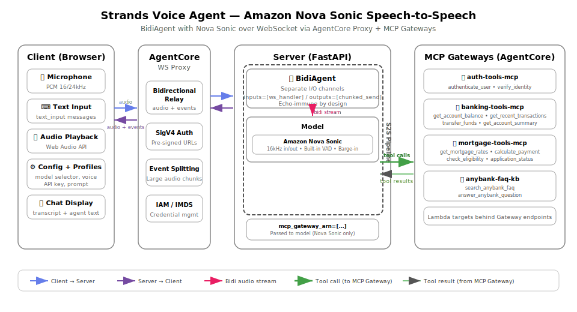
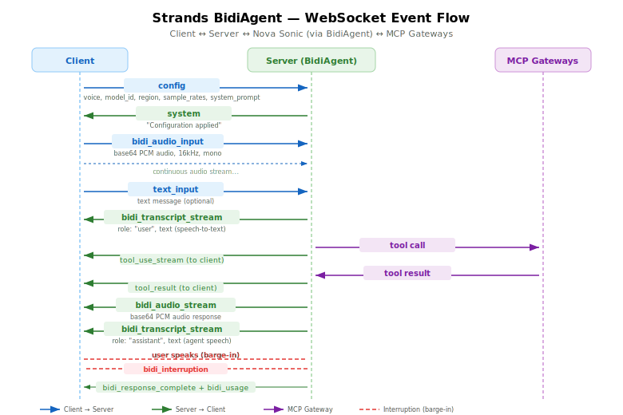

# Strands Voice Agent (Amazon Nova Sonic Speech-to-Speech)

A bidirectional voice agent using **Amazon Nova Sonic**. Built with Strands `BidiAgent`, deployed on Amazon Bedrock AgentCore with MCP Gateway tool access.

## Architecture



The `BidiAgent` manages the bidirectional stream between the client and the model. Nova Sonic processes audio input and generates audio output natively — no separate STT/TTS pipeline.

## Key Components

| File | Purpose |
|------|---------|
| `websocket/server.py` | FastAPI server, IMDS credentials, WebSocket endpoint, large event splitting |
| `websocket/agent.py` | Session handler, BidiAgent setup for Nova Sonic |
| `client/client.py` | HTTP server that serves the HTML client |
| `client/strands-client.html` | Browser-based voice/text client with config modal |
| `client/profiles.json` | Pre-configured agent profiles (Finance, General, Tech Support) |
| `mcp/auth_mcp.py` | Authentication MCP server (authenticate_user, verify_identity) |
| `mcp/banking_mcp.py` | Banking MCP server (balance, transactions, transfers, summary) |
| `mcp/mortgage_mcp.py` | Mortgage MCP server (rates, calculator, eligibility, status) |
| `mcp/faq_kb_mcp.py` | FAQ knowledge base MCP server (search, answer with citations) |

## How BidiAgent Works

The core of the agent is the `BidiAgent` with separated I/O channels:

```python
model = BidiNovaSonicModel(region=..., model_id=..., provider_config={...}, mcp_gateway_arn=[...])

agent = BidiAgent(
    model=model,
    tools=[],
    system_prompt=system_prompt,
)

await agent.run(inputs=[handle_websocket_input], outputs=[chunked_send_json])
```

- `inputs` — async functions that yield messages from the client (audio chunks, text input). The `handle_websocket_input` function filters out config events and routes text/audio appropriately.
- `outputs` — the `chunked_send_json` wrapper in `server.py` splits large audio events before sending over WebSocket.

This separation makes the agent naturally immune to AgentCore's WebSocket proxy echo.

## Large Event Splitting

The `split_large_event` function in `server.py` handles oversized audio output events:

- Events >10KB are split by dividing the `audio` field into smaller chunks
- Splits are aligned to 4-character base64 boundaries to avoid decoding corruption
- Each chunk preserves the original event structure
- The `chunked_send_json` output wrapper applies this automatically to all outbound events

## Voice Activity Detection (VAD)

Nova Sonic handles VAD internally within the model — no custom silence detection needed. The model detects speech boundaries natively and supports barge-in.

## MCP Gateway Integration

Tools are accessed via AgentCore MCP Gateways. Four gateways are deployed:

| Gateway | MCP Server | Tools |
|---------|-----------|-------|
| auth-tools | auth-tools-mcp | `authenticate_user`, `verify_identity` |
| banking-tools | banking-tools-mcp | `get_account_balance`, `get_recent_transactions`, `transfer_funds`, `get_account_summary` |
| mortgage-tools | mortgage-tools-mcp | `get_mortgage_rates`, `calculate_mortgage_payment`, `check_mortgage_eligibility`, `get_mortgage_application_status` |
| faq-kb-tools | anybank-faq-kb | `search_anybank_faq`, `answer_anybank_question` |

Gateway ARNs are passed to the model via the `mcp_gateway_arn` parameter and are configured server-side via the `MCP_GATEWAY_ARNS` environment variable.

## WebSocket Messages (client ↔ server)



### Client → Server

| Type | Fields | Description |
|------|--------|-------------|
| `config` | `voice`, `model_id`, `region`, `input_sample_rate`, `output_sample_rate`, `system_prompt` | Initial session configuration (must be first message) |
| `text_input` | `text` | Text message to send to the agent |
| `bidi_audio_input` | `audio` (base64), `format`, `sample_rate`, `channels` | PCM audio chunk from the microphone |

### Server → Client

| Type | Fields | Description |
|------|--------|-------------|
| `bidi_audio_stream` | `audio` (base64) | Audio output from the model |
| `bidi_transcript_stream` | `text`, `role`, `delta` | Transcript of user speech or agent response |
| `bidi_interruption` | — | User interrupted the agent (barge-in) |
| `bidi_response_complete` | — | Agent finished responding |
| `bidi_usage` | `inputTokens`, `outputTokens`, `totalTokens` | Token usage stats |
| `tool_use_stream` | `current_tool_use` | Tool invocation in progress |
| `tool_result` | `tool_result` | Tool execution result |
| `system` | `message` | Status/info messages |
