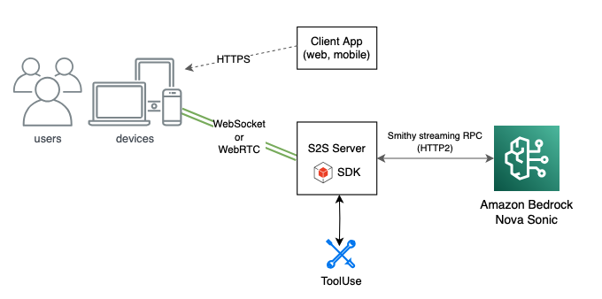
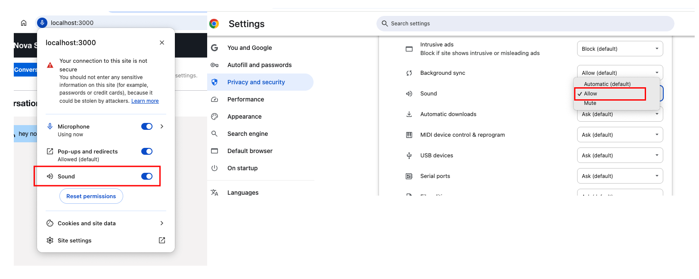
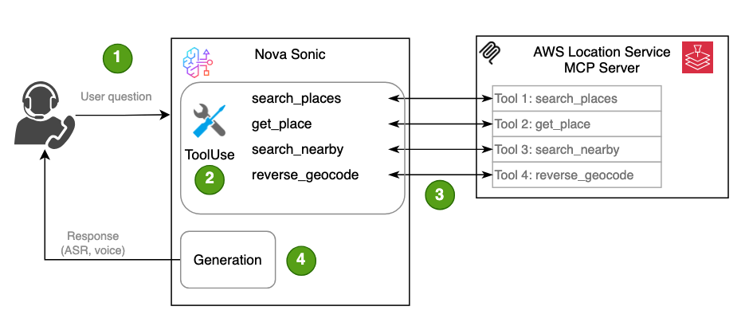
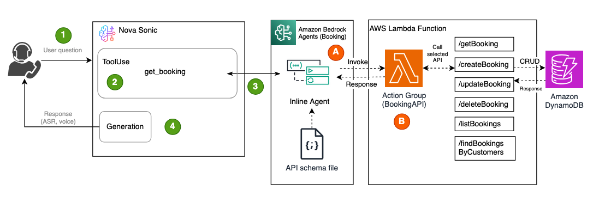
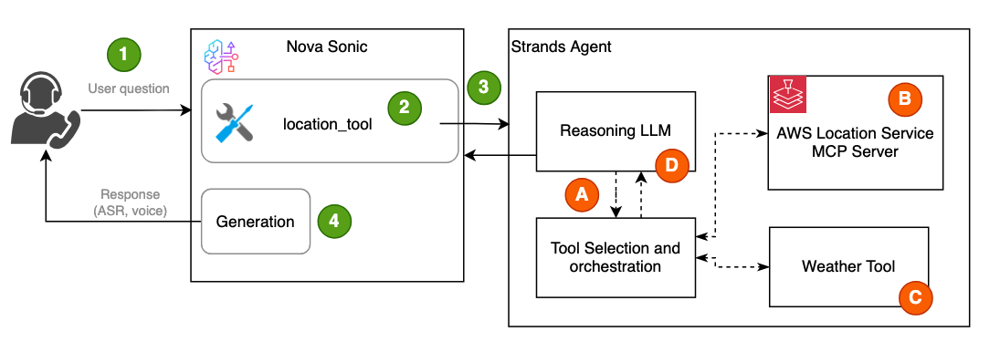

# Nova S2S ワークショップ サンプルコード

> 🆕 **V2 アップデート（2025 年 11 月）**: セッション管理、イベント処理、UI コンポーネントが強化され、安定性とユーザー体験が向上しました。V2 では、WebSocket 接続処理の最適化、より良い状態管理、改善された音声処理が含まれます。

> 2025 年 8 月 26 日 🆕🚀 Amazon Bedrock AgentCore を利用した新しい Nova Sonic マルチエージェント アーキテクチャ ラボが追加されました。詳細とサンプルコードは [./agent-core](./agent-core/) フォルダを参照してください。

このプロジェクトは [Amazon Nova Sonic speech-to-speech (S2S) workshop](https://catalog.workshops.aws/amazon-nova-sonic-s2s/en-US) 向けのもので、トレーニング用途を目的としています。Nova Sonic と統合するアプリケーションを構築するためのサンプルアーキテクチャを示しており、教育目的で技術的な詳細を見せるための機能が組み込まれています。

（Nova Sonic LiveKit Lab は異なるアーキテクチャを使用します。詳細はこの [README](./livekit/README.md) を参照してください）

モバイルまたは Web クライアントにサービスを提供するため、インターネット公開接続が必要なアーキテクチャでは、以下のアプローチを推奨します。



このプロジェクトには 2 つの中核コンポーネントがあります。
- Nova Sonic との双方向ストリーミング接続を管理する Python ベースの WebSocket サーバー
- WebSocket サーバー経由で S2S システムと通信する React フロントエンド アプリケーション

### 前提条件
- Python 3.12+
- UI 開発用の Node.js 14+ と npm/yarn
- Bedrock へアクセス可能な AWS アカウント
- ローカルに設定済みの AWS 認証情報
- AWS アカウント上で必要モデルへのアクセスをセルフサービスで有効化できること。手順は [this process](https://catalog.workshops.aws/amazon-nova-sonic-s2s/en-US/100-introduction/03-model-access) を参照してください。
    - Titan text embedding v2
    - Nova Lite
    - Nova Micro
    - Nova Pro
    - Nova Sonic

## インストール手順
以下の手順で Python WebSocket サーバーと React UI の両方を構築して起動します。これにより、S2S と会話しながら基本機能を試せます。

リポジトリをクローンします。

```bash
git clone https://github.com/aws-samples/amazon-nova-samples
mv amazon-nova-samples/speech-to-speech/workshops nova-s2s-workshop
rm -rf amazon-nova-samples
cd nova-s2s-workshop
```

### Python websocket サーバーのインストールと起動
1. Python 仮想環境を開始します
    ```
    cd python-server
    python3 -m venv .venv
    ```
    Mac
    ```
    source .venv/bin/activate
    ```
    Windows
    ```
    .venv\Scripts\activate
    ```

2. Python 依存関係をインストールします:
    ```bash
    pip install -r requirements.txt
    ```

3. 環境変数を設定します:

    Python アプリケーションでは、内部で利用する Smithy 認証ライブラリの都合上、AWS access key と secret が必要です。
    ```bash
    export AWS_ACCESS_KEY_ID="YOUR_AWS_ACCESS_KEY_ID"
    export AWS_SECRET_ACCESS_KEY="YOUR_AWS_SECRET"
    export AWS_DEFAULT_REGION="us-east-1"
    ```
    WebSocket の host と port は任意です。指定しない場合、アプリケーションは既定で `localhost` とポート `8081` を使用します。
    ```bash
    export HOST="localhost"
    export WS_PORT=8081
    ```
    ヘルスチェック用ポートは ECS/EKS のようなコンテナデプロイ向けに任意です。以下の環境変数を指定しない場合、サービスはヘルスチェック用 HTTP エンドポイントを起動しません。
    ```bash
    export HEALTH_PORT=8082
    ```

4. Python websocket サーバーを起動します
    ```bash
    python server.py
    ```

> Python WebSocket サーバーは起動したままにし、その後、以下の手順で React Web アプリケーションを起動してください。React アプリはこの WebSocket サービスへ接続します。

### REACT フロントエンド アプリケーションのインストールと起動
1. `react-client` フォルダへ移動します
    ```bash
    cd react-client
    ```
2. インストールします
    ```bash
    npm install
    ```

3. この手順は任意です。React アプリ用の環境変数を設定します。指定しない場合、アプリケーションは既定で `ws://localhost:8081` を使用します。

    ```bash
    export REACT_APP_WEBSOCKET_URL='YOUR_WEB_SOCKET_URL'
    ```

4. ワークショップ環境の外で React コードを実行したい場合は、`react-client/package.json` の `homepage` 値を `/proxy/3000/` から `.` へ変更してください。

5. 実行します
    ```
    npm start
    ```

Chrome 使用時に音が出ない場合は、以下のようにサウンド設定が Allow になっていることを確認してください。


⚠️ **Warning:** 既知の問題: この UI はデモ目的のため、会話の開始 / 停止を頻繁に行うと state management の問題が発生することがあります。ページを再読み込みすると解消できる場合があります。

## 再利用可能パターン
このワークショップには [repeatable patterns](https://catalog.workshops.aws/amazon-nova-sonic-s2s/en-US/200-labs/02-repeatable-pattern) のサンプルが含まれており、[Bedrock Knowledge Bases (RAG)](https://catalog.workshops.aws/amazon-nova-sonic-s2s/en-US/200-labs/02-repeatable-pattern/01-kb-lab)、[MCP](https://catalog.workshops.aws/amazon-nova-sonic-s2s/en-US/200-labs/02-repeatable-pattern/02-mcp-lab)、[Bedrock Agents](https://catalog.workshops.aws/amazon-nova-sonic-s2s/en-US/200-labs/02-repeatable-pattern/04-bedrock-agents)、[Strands Agent](https://catalog.workshops.aws/amazon-nova-sonic-s2s/en-US/200-labs/02-repeatable-pattern/03-strands) など、一般的な統合例を紹介しています。自身の環境でワークショップを実行する場合、一部機能では追加デプロイ手順が必要です。各機能の手順は以下に記載しています。

### Bedrock Knowledge Base (RAG) 連携
このワークショップには、RAG（Retrieval-Augmented Generation）ベースの質問応答を示すための [Amazon Bedrock Knowledge Bases](https://aws.amazon.com/bedrock/knowledge-bases/) 連携サンプルが含まれています。

Amazon Bedrock Knowledge Bases が初めてで、AWS コンソール UI を使ったセットアップ方法を知りたい場合は [this blog](https://aws.amazon.com/blogs/aws/knowledge-bases-now-delivers-fully-managed-rag-experience-in-amazon-bedrock/) を参照してください。

- この機能を有効にするには、Knowledge Base ID を環境変数として設定します。Knowledge Base のリージョン指定は任意で、Knowledge Base が Sonic と異なるリージョンで動いている場合のみ必要です。
    ```bash
    export KB_REGION='YOUR_KNOLEDGE_BASE_REGION_NAME'
    export KB_ID='YOUR_KNOWLEDGE_BASES_ID'
    ```

- `python-server` フォルダへ移動し、websocket サーバーを起動します:
    ```bash
    python server.py
    ```
その後、サンプル UI を使って、Knowledge Base にインデックスしたデータに関する質問ができます。

たとえば、講師主導ワークショップでは [Amazon Nova User Guide](https://docs.aws.amazon.com/nova/latest/userguide/what-is-nova.html) の PDF がロードされていたため、次のような質問ができます。
```
What is Amazon Nova Sonic?
```

より詳細な手順は [the RAG lab](https://catalog.workshops.aws/amazon-nova-sonic-s2s/en-US/200-labs/02-repeatable-pattern/01-kb-lab) を参照してください。

### MCP 連携

このワークショップには、[MCP](https://modelcontextprotocol.io/introduction)（Model Context Protocol）のような一般的な agentic framework との連携サンプルが含まれています。例として、STDIO モードでデプロイされた [AWS Location MCP server](https://github.com/awslabs/mcp?tab=readme-ov-file#aws-location-service-mcp-server) を使用し、位置情報関連の質問に答えるための直接的な tool invocation を実演します。



MCP 連携を試すには、次の追加セットアップが必要です。

- [Astral](https://docs.astral.sh/uv/getting-started/installation/) から uv をインストールする

- 使用する AWS profile に Location Services 用の必要権限があることを確認し、profile 名を環境変数に設定する
```bash
export AWS_PROFILE='YOUR_AWS_PROFILE'
```

- `python-server` フォルダへ移動し、websocket サーバーを起動します:
```bash
python server.py --agent mcp
```

- その後、サンプル UI から次のような質問を試せます:
```
Find me the location of the largest zoo in Seattle.

Find the largest shopping mall in New York City.
```

より詳細な手順は [the MCP lab](https://catalog.workshops.aws/amazon-nova-sonic-s2s/en-US/200-labs/02-repeatable-pattern/02-mcp-lab) を参照してください。

### Bedrock Agents 連携
このワークショップには、予約シナリオを紹介するための [Bedrock Agents](https://docs.aws.amazon.com/bedrock/latest/userguide/agents.html) 連携サンプルが含まれています。
Bedrock Agents 連携を試すには、以下の手順に従ってください。



- AWS CLI がインストール済みであることを確認します。未インストールの場合は [here](https://docs.aws.amazon.com/cli/latest/userguide/getting-started-install.html) を参照してください。

- 対象 AWS アカウントへアクセスするための適切な権限が環境にあることを確認し、以下のコマンドを実行します。
    ```bash
    aws cloudformation deploy --template-file ./scripts/booking-resources.yaml --stack-name bedrock-agents --capabilities CAPABILITY_NAMED_IAM
    ```
    この CloudFormation テンプレートは次のリソースを作成します。

    1. DynamoDB Table (Bookings)
    2. IAM Role for Lambda (BookingLambdaRole)
    3. Lambda Function (BookingFunction)
    4. Lambda Permission for Bedrock
    5. Bedrock Execution Role (BedrockExecutionRole)

- CloudFormation スタックは Lambda function ARN を出力します。サンプルアプリがアクセスするため、これを環境変数 `BOOKING_LAMBDA_ARN` に設定する必要があります。以下のコマンドで ARN を取得して環境変数へ設定します。

    ```bash
    export BOOKING_LAMBDA_ARN=$(aws cloudformation describe-stacks --stack-name bedrock-agents --query "Stacks[0].Outputs[?OutputKey=='BookingLambdaArn'].OutputValue" --output text)
    ```

- `python-server` フォルダへ移動し、websocket サーバーを起動します:
    ```bash
    python server.py
    ```

- その後、サンプル UI から次のような予約関連の質問を試してください:
```
Can you make a booking for John for May 25th at 7 p.m.?
Can you check if there are any bookings for John?
Can you update the booking to May 25th at 7:30 p.m.?
Can you cancel the booking?
```

より詳細な手順は [the Bedrock Agents lab](https://catalog.workshops.aws/amazon-nova-sonic-s2s/en-US/200-labs/02-repeatable-pattern/04-bedrock-agents) を参照してください。

### Strands Agent 連携
このワークショップでは、外部ワークフローをオーケストレーションする [Strands Agent](https://community.aws/content/2xCUnoqntk2PnWDwyb9JJvMjxKA/step-by-step-guide-setting-up-a-strands-agent-with-aws-bedrock) の使い方を示します。[AWS Location MCP server](https://github.com/awslabs/mcp?tab=readme-ov-file#aws-location-service-mcp-server) とサンプル Weather tool を統合し、高度なエージェント推論とオーケストレーションを紹介します。



Strands Agent 連携を試すには、次の追加セットアップが必要です。

- [Astral](https://docs.astral.sh/uv/getting-started/installation/) から uv をインストールする

- 使用する AWS profile に Location Services 用の必要権限があることを確認し、profile 名を環境変数に設定する
```bash
export AWS_PROFILE='YOUR_AWS_PROFILE'
```

- `python-server` フォルダへ移動し、websocket サーバーを起動します:
```bash
python server.py --agent strands
```
- その後、サンプル UI から次のような質問を試せます:
```
What’s the weather like in Seattle today?
```

より詳細な手順は [the Strands Agent lab](https://catalog.workshops.aws/amazon-nova-sonic-s2s/en-US/200-labs/02-repeatable-pattern/03-strands) を参照してください。