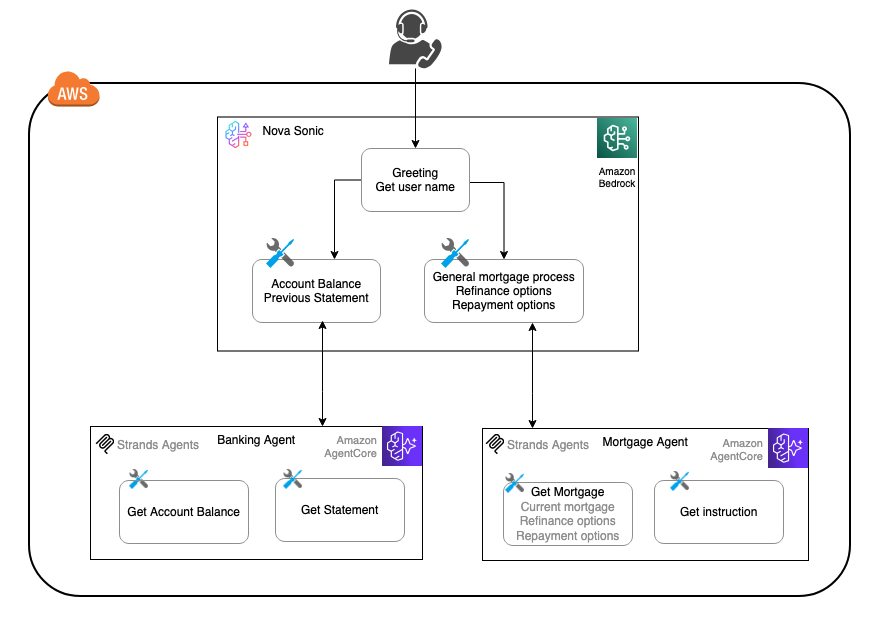
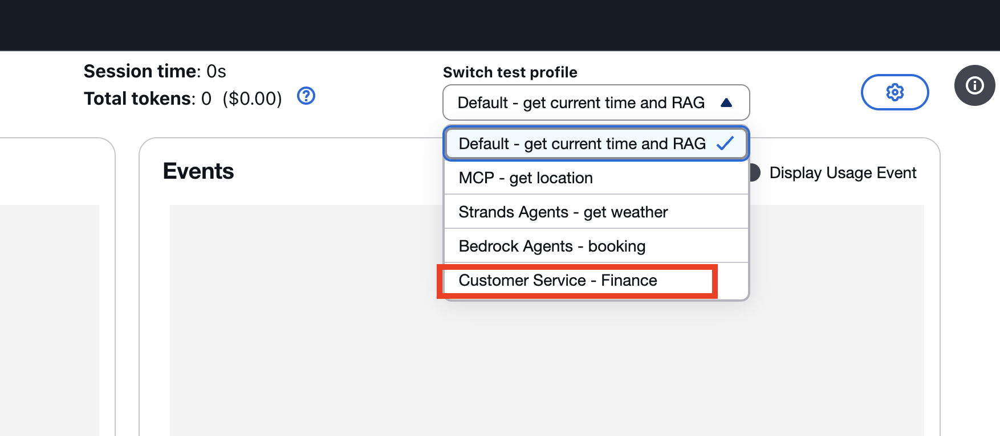

# Amazon Bedrock AgentCore を活用した Nova Sonic マルチエージェント アーキテクチャ

マルチエージェント アーキテクチャは、AI アシスタント設計で広く使われているパターンです。Nova Sonic のような音声アシスタントでは、このアーキテクチャによって複数の専門エージェントを調整し、複雑なタスクを処理します。各エージェントは独立して動作できるため、並列処理、モジュラー設計、スケーラブルなソリューションが可能になります。

このラボでは、銀行向け音声アシスタントを例に、専門エージェントを [Amazon Bedrock AgentCore](https://aws.amazon.com/bedrock/agentcore/) 上へデプロイする方法を示します。Nova Sonic をオーケストレーターとして使い、[AgentCore Runtime](https://docs.aws.amazon.com/bedrock-agentcore/latest/devguide/agents-tools-runtime.html) 上でホストされる [Strands Agents](https://strandsagents.com/latest/documentation/docs/) で書かれたサブエージェントへ詳細な問い合わせを委譲します。

> このラボでは、Amazon Bedrock AgentCore 上にデプロイした Strands Agents フレームワークのサンプル サブエージェントを示していますが、構成は柔軟です。利用者は好みの agent framework、LLM、hosting option を選べます。



会話フローはシンプルです。挨拶とユーザー名の取得から始まり、その後、銀行業務や住宅ローンに関する問い合わせを処理できます。専門ロジックを扱うために、AgentCore 上でホストされた 2 つのサブエージェントを使います。
- Banking Sub-Agent: 口座残高照会、明細、その他の銀行関連問い合わせを処理
- Mortgage Sub-Agent: 借り換え、金利、返済オプションなど住宅ローン関連の問い合わせを処理

Nova Sonic はオーケストレーターとして全体フローを管理し、特定タスクを各サブエージェントへ振り分けます。

サブエージェントは banking と mortgage のロジックに特化しており、入力検証、ツール選択、データソース統合、応答生成などを担当します。この方式により、ドメイン固有ロジックをサブエージェント層に閉じ込められ、モジュラー設計が実現し、Nova Sonic 側のオーケストレーションも単純化できます。

> AgentCore Runtime 上にデプロイされる Mortgage Agent と Banking Agent は静的応答を返します。このサンプルはアーキテクチャ パターンとデプロイ手順を示すことを目的としています。実運用では、これらのエージェントは API、データベース、RAG、その他のバックエンドサービスからデータを取得する想定です。

## サブエージェントを Amazon Bedrock AgentCore Runtime へデプロイする
リポジトリをクローンします。親フォルダの手順ですでにクローン済みなら、この手順は省略してください。

```bash
git clone https://github.com/aws-samples/amazon-nova-samples
mv amazon-nova-samples/speech-to-speech/workshops nova-s2s-workshop
rm -rf amazon-nova-samples
```

コードを AgentCore Runtime へデプロイします。追加のデプロイ例は [AgentCore sample repo](https://github.com/awslabs/amazon-bedrock-agentcore-samples/tree/main/01-tutorials/01-AgentCore-runtime/01-hosting-agent/01-strands-with-bedrock-model) を参照してください。
```bash
cd nova-s2s-workshop/agent-core
source ./deploy-agentcore-runtime.sh
```

## Nova Sonic の音声チャット経由でテストする
Python WebSocket と React Web アプリケーションの起動については、親階層の [the instructions](../README.md) に従ってください。

Python WebSocket アプリケーションは、前の手順で設定された環境変数から Mortgage agent と Banking agent の AgentCore Runtime ARN を取得します。

次に、test profile のドロップダウンから `Customer Service – Finance` を選択し、銀行カスタマーサービス会話を開始します。



名前を伝えた後、次のような質問ができます。

```Can you check my account balance?```

```Am I eligible for refinancing?```

## Nova Sonic マルチエージェントのベストプラクティス
マルチエージェント アーキテクチャは柔軟性とモジュラー設計を提供し、音声アシスタントを効率的に構成し、既存の専門エージェント ワークフローを再利用できる可能性もあります。ただし、音声チャット特有のベストプラクティスも考慮する必要があります。

Best Practices:

- 柔軟性とレイテンシのバランスを取る: Nova Sonic ToolUse event 経由でサブエージェントを呼び出すと、音声応答に遅延が加わることがあります。

- サブエージェントには小さめの LLM を使う: Nova Lite のようなモデルから始めると、レイテンシ低減に役立ちます。

- 応答長を最適化する: 音声アシスタントは短い応答とフォローアップの方が、レイテンシとユーザー体験の両面で有利です。

- Stateless / statefull なサブエージェント設計:
    - Stateless sub-agent: 各リクエストを独立して処理し、過去のやり取りを記憶しません。単純でスケールしやすい一方、文脈依存の応答はできません。
    - Stateful sub-agent: やり取りをまたいで記憶を保持し、文脈依存の応答が可能です。パーソナライズされた体験を提供できますが、より複雑でリソース消費も大きくなります。

    したがって:
    
    - 単純なタスクには stateless sub-agent を使い、複数ターンや文脈依存ワークフローには stateful なものを使う
    - Nova Sonic orchestrator に session-level state を持たせつつ、専門タスクを委譲する