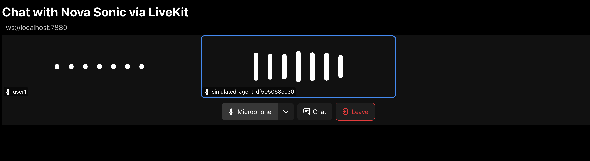

# LiveKit を使った Nova Sonic

[LiveKit](https://livekit.io/?utm_source=aws&utm_medium=blog&utm_campaign=nova_sonic_plugin) は、見て、聞いて、話せる voice、video、physical AI アプリケーションを構築するためのオープンソース プラットフォームです。Amazon Nova Sonic は現在、[Nova Sonic plugin](https://docs.livekit.io/agents/integrations/realtime/nova-sonic/?utm_source=aws&utm_medium=blog&utm_campaign=nova_sonic_plugin) を通じて LiveKit と統合できます。

LiveKit は WebRTC ベースのアプリケーションを支える高水準 SDK を提供します。LiveKit 経由で Nova Sonic と通信するフルスタック アプリケーションを起動するには、以下のコンポーネントが必要です。このワークショップでは、これらのコンポーネントをさまざまな方法でデプロイする手順を案内します。Nova Sonic と対話する LiveKit ベース アプリケーションを作りたい開発者向けの出発点として使えます。

1. LiveKit Server: オープンソース ライブラリから起動するサーバーで、インターネット越しの WebRTC 通信を可能にします。

2. LiveKit Agent (Python): Nova Sonic と統合するカスタム Python エージェントです。ここがカスタム実装を必要とするコンポーネントです。

3. LiveKit UI
    - 既定の LiveKit agent playground はオープンソースの Web アプリケーションです。このラボではホスト版を使いますが、GitHub 上の [source code on GitHub](https://github.com/livekit/agents-playground/) を使って独自にデプロイ・カスタマイズすることも可能です。
    - サンプルコードには `ui` フォルダ内に、カスタマイズ済み LiveKit UI の例として軽量な React Web アプリケーションも含まれています。


## LiveKit のインストール
リポジトリをクローンします。親フォルダの手順ですでにクローン済みなら、この手順は省略してください。

```bash
git clone https://github.com/aws-samples/amazon-nova-samples
mv amazon-nova-samples/speech-to-speech/workshops nova-s2s-workshop
rm -rf amazon-nova-samples
cd nova-s2s-workshop/livekit
```

Homebrew をインストールします。すでに導入済みなら、この手順は省略してください。
> このコマンドは x86 アーキテクチャ向けです。ARM ベースのシステムを使っている場合は、別の手順が必要な可能性があります。
```bash
if command -v brew >/dev/null 2>&1; then
    echo "Homebrew is installed."
else
    sudo dnf groupinstall "Development Tools" -y
    sudo dnf install curl file git gcc bzip2 tar -y
    echo | /bin/bash -c "$(curl -fsSL https://raw.githubusercontent.com/Homebrew/install/HEAD/install.sh)"
    eval "$(/home/linuxbrew/.linuxbrew/bin/brew shellenv)"
    source ~/.bashrc
fi
```

LiveKit と CLI をインストールします。
```bash
brew install livekit livekit-cli
```

UV をインストールします。
```bash
curl -LsSf https://astral.sh/uv/install.sh | sh
```

### LiveKit Server の起動
以下のコマンドで LiveKit Server を起動します。
```bash
livekit-server --dev
```
既定では、LiveKit サーバーはポート 7880（Websocket）およびポート 7881、7882（WebRTC）で利用可能になります。

LiveKit server を起動したターミナルはそのままにしておき、次に LiveKit Agent を起動します。

### LiveKit Agent の起動
新しいターミナルを開き、LiveKit フォルダへ移動します。

```bash
cd nova-s2s-workshop/livekit
```

続いて Python 仮想環境を開始し、依存関係をインストールします。
```bash
python3 -m venv .venv
source .venv/bin/activate

pip install --upgrade pip
pip install -r requirements.txt
```

LiveKit API key と secret を環境変数に設定します。開発環境では既定値の `devkey` と `secret` を使用できます。

```bash
export LIVEKIT_API_KEY=devkey
export LIVEKIT_API_SECRET=secret
```

AWS 認証情報を環境変数に設定します。
> 永続的なアイデンティティ（例: IAM user）を使う場合、session token は任意です。
```bash
export AWS_ACCESS_KEY_ID=<aws access key id>
export AWS_SECRET_ACCESS_KEY=<aws secret access key>
export AWS_SESSION_TOKEN=<aws session token>
```

以下のコマンドで LiveKit Agent を起動します。ソースコードは [here](./agent.py) にあります。
```bash
uv run python agent.py connect --room my-first-room
```

### ホスト版 LiveKit playground UI の起動

- まず、ブラウザの新しいタブで [https://agents-playground.livekit.io/](https://agents-playground.livekit.io/) を開きます。

- *Manual* タブを選択します。


- 最初のテキストフィールドに、前の手順で起動した LiveKit server の HTTP URL `ws://localhost:7880` を入力します。

- 新しいターミナルで以下のコマンドを実行します。24 時間有効な LiveKit token が出力されます。
    ```bash
    cd nova-s2s-workshop/livekit

    source .venv/bin/activate
    eval "$(/home/linuxbrew/.linuxbrew/bin/brew shellenv)"

    lk token create \
    --api-key devkey --api-secret secret \
    --join --room my-first-room --identity user1 \
    --valid-for 24h
    ```

- 出力された access token をコピーし、*room token* フィールド（2 番目のフィールド）へ貼り付けます。
- *Connect* を選択します。
    これで LiveKit Sandbox UI 経由で Sonic に接続されます。いつでも Sonic と会話を始められます。

    

> LiveKit room から切断された場合、Amazon Nova Sonic と再度会話するには agent process（agent.py）を再起動する必要があります。

## tool 付き LiveKit agent の起動
このワークショップには、LiveKit agent でツールを定義する方法を示す [a second example](./agent-tool.py) が含まれています。

LiveKit server は起動したままにしておき、別ファイルへ切り替えるために LiveKit Agent を再起動します。

```bash
uv run python agent-tool.py connect --room my-first-room
```

LiveKit Playground は、自動的に新しく起動した別の voice を持つ agent に接続するはずです。接続されない場合は、LiveKit Playground ページを再読み込みし、Manual mode で再接続してください。

これで Sonic と会話し、次のような天気関連の質問ができます。
```
How's the weather in Seattle today?
```

## カスタマイズ済み LiveKit UI を使う
このワークショップには、独自 UI を構築する際のクイックスタートとして使える [a customized REACT web application](./ui) が含まれています。

`nova-s2s-workshop/livekit` フォルダ内で `ui` フォルダへ移動します。
```bash
cd nova-s2s-workshop/livekit/ui
```

以下のコマンドで、React アプリケーションが参照できるよう LiveKit server URL と access token を `.env` ファイルへ保存します。
```bash
eval "$(/home/linuxbrew/.linuxbrew/bin/brew shellenv)"

OUTPUT=$(lk token create \
  --api-key devkey --api-secret secret \
  --join --room my-first-room --identity user1 \
  --valid-for 24h)

LIVEKIT_TOKEN=$(echo "$OUTPUT" | sed -n 's/^Access token: //p')

echo "REACT_APP_LIVEKIT_SERVER_URL=ws://localhost:7880" > .env
echo "REACT_APP_LIVEKIT_TOKEN=$LIVEKIT_TOKEN" >> .env
```

REACT 依存関係をインストールし、アプリを起動します。
```bash
npm install
npm start
``` 
カスタマイズ済み UI アプリケーションがブラウザの新しいタブで開きます。必要に応じて拡張しやすいシンプルな設計になっています。
